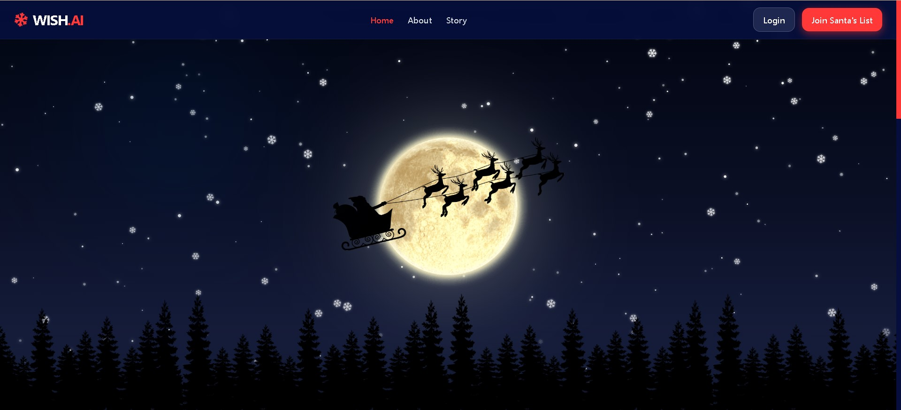

# 🎄 WISH - Worldwide Intelligent Santha Hub

**W.I.S.Hub** is a magical, full-stack Christmas-themed platform where users can interact with an AI Santa, share festive memories in a community gallery, and make heart-warming wishes. Built with a premium aesthetic and modern tech stack, it brings the spirit of the North Pole to the digital world.


<p align="center">
  
</p>

<p align="center">
  <a href="https://wish.agriflow.space" target="_blank">
    
  </a>
  &nbsp;
  <a href="" target="_blank">
    
  </a>
  &nbsp;
  <a href="" target="_blank">
    
  </a>
</p>

---

## ✨ Features

### 👤 User Features
- **AI Santa Chat**: Secure, private 1-on-1 chat with an intelligent AI Santa for festive conversations and holiday advice.
- **Magical Wish List**: Users can submit up to 3 special wishes. Watch as the magic happens when Santa (Admin) grants them.
- **Event Gallery**: Share up to 3 "Magical Moments" with high-quality images and quotes. Features robust client-side and server-side validation (5MB max, format checks).
- **Dual Authentication**: Seamless login/signup via traditional email or Google OAuth integration.
- **Premium Responsive UI**: A mobile-first design with fluid animations (Framer Motion), dark-themed "Sleigh Mode," and intuitive navigation.

### 🎅 Admin (Santha) Features
- **Global Wish Management**: Overview of all wishes submitted worldwide. Grant individual wishes or perform "Grand Magic" to grant all at once.
- **User Management**: Monitor the North Pole's citizens. Search, filter (Active/Blocked), and manage user access.
- **Magical Surveillance**: Access chat logs and monitor the spirits of users to ensure the holiday joy is spreading.

---

## 🛠️ Tech Stack

### Frontend
- **React 19 & Vite** - Ultra-fast development and optimized production builds.
- **Redux Toolkit** - Sophisticated state management with persistence.
- **Tailwind CSS** - Modern, utility-first styling for a premium aesthetic.
- **Framer Motion** - Silky-smooth holiday-themed transitions and animations.
- **Formik & Yup** - Professional-grade form handling and validation.

### Backend
- **Django & DRF** - Powerful, secure RESTful API framework.
- **Cloudinary** - Cloud-based magical storage for all festive imagery.
- **AI Integration** - Custom logic for AI-powered Santa conversations.
- **PostgreSQL** - Reliable storage for wishes and user data.

---

## 🚀 Setup Instructions

### Prerequisites
- Python 3.10+
- Node.js 18.x+
- NPM or Yarn

### 1. Backend Setup
```bash
# Navigate to backend directory
cd backend

# Create virtual environment
python -m venv venv
source venv/bin/activate  # Windows: venv\\Scripts\\activate

# Install dependencies
pip install -r requirements.txt

# Configure Environment Variables
# Create a .env file based on the provided settings
# Copy the contents of `.env.example` into `.env`. 
# Include: DATABASE_URL, CLOUDINARY_URL, SECRET_KEY, GOOGLE_OAUTH_CLIENT_ID

# Run migrations
python manage.py makemigrations
python manage.py migrate

# Start the North Pole Server
python manage.py runserver
```

### 2. Frontend Setup
```bash
# Navigate to frontend directory
cd frontend

# Install dependencies
npm install

# Configure Environment Variables
# Create a .env file
# Copy the contents of `.env.example` into `.env`. ( add VITE_API_BASE_URL and VITE_GOOGLE_CLIENT_ID etc...)

# Start Sleigh Development Mode
npm run dev
```

---

## 📁 Project Structure

```bash
WISH/
├── backend/
│   ├── apps/
│   │   ├── chat/      # AI Santa Chat Logic
│   │   ├── gallery/   # Magical Moment Gallery
│   │   ├── users/     # Role-based User Auth
│   │   └── wishes/    # Wish Management System
│   └── wish_backend/  # Main Config
└── frontend/
    ├── src/
    │   ├── components/ # Reusable UI & Layouts
    │   ├── pages/      # Magical Views
    │   ├── services/   # API Integration
    │   └── redux/      # Sleigh State Management
    └── public/         # Static Holiday Assets
```

---

## 📜 License
This project is part of the Worldwide Intelligent Santha Hub. Spreading holiday joy since 2025. ❄️
